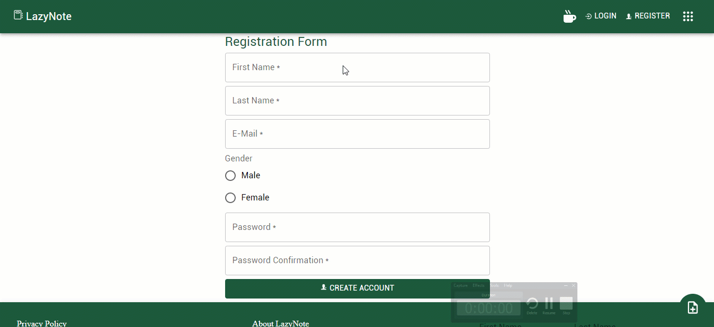

<span style="font-size:30px;"> LazyNote<span/>
<br/>


#### Note network for publishing and create notes whether public or private for each user created with Laravel 8 and React 17.0.2

- ReactJs 
- Laravel 
- Material UI <br/>

### Used Packages:
- Sanctum
- React Router Dom
- AlertifyJS
- React Icons
- Axios
- Gulp
<hr/>

## Installation

#### React Configuration

```sh
    cd lazynote-frontend
```

```sh
    npm install
```

```sh
    npm start
```

#### Laravel Configuration

```sh
    cd lazynote-backend
```

```sh
    composer install
```

```sh
    php artisan key:generate
```

```sh
    php artisan migrate
```

```sh
    php artisan serve
```

#### Testing

> open: http://127.0.0.1:3000/